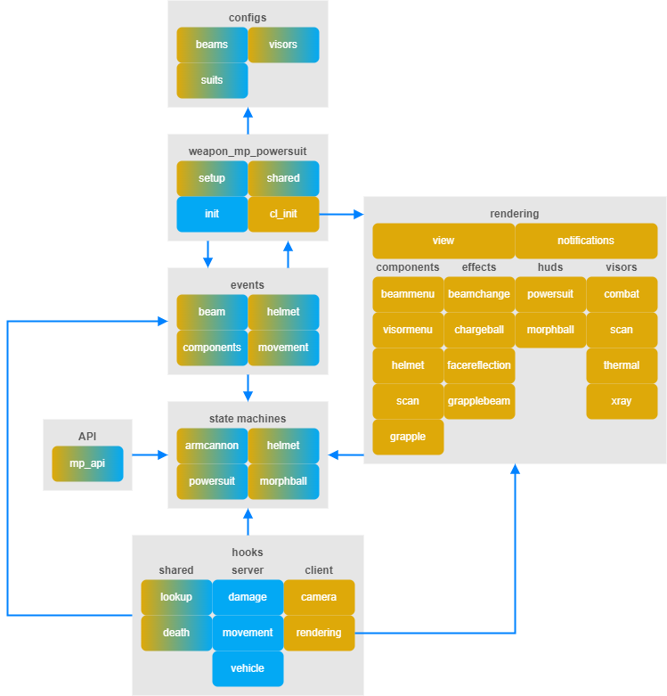
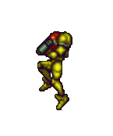

<p align="center"></p>

# Metroid Prime SWEP
Metroid Prime SWEP is a passion project recreation of the original Metroid Prime character controller for Garry's Mod with utmost fidelity in mind. The project also ships with a comprehensive API and a multitude of hooks for developers to integrate their own add-ons.

[Workshop Link](https://steamcommunity.com/sharedfiles/filedetails/?id=3041333779)

---

#### Features
- Save States
- Power Beam, Wave Beam, Ice Beam and Plasma Beam
- Charge Beam
- Missiles
- Super Missiles, Wavebuster, Ice Spreader and Flamethrower
- Combat Visor, Scan Visor, Thermal Visor and X-Ray Visor
- Lock On System
- Log Book System
- Space Jump, Dashing and Air Movement
- Grapple Beam
- Power Suit, Varia Suit, Gravity Suit and Phazon Suit damage reduction
- Morph Ball, Boost Ball, Spider Ball
- Bombs and Power Bombs
- And more...

#### Controls
| Key | Default | Action |
| ------ | ------ | ------ |
| IN_ATTACK | Mouse 1 | Fire Beam, Charge Beam, Bombs (Morph Ball) |
| IN_ATTACK2 | Mouse 2 | Fire Missile, Missile Combo, Power Bombs (Morph Ball) |
| IN_SPEED | Shift | Lock On, Scan, Grapple Beam, Spider Ball (Morph Ball) |
| IN_JUMP | Space Bar | Space Jump, Dash (Lock On), Boost Ball (Morph Ball) |
| KEY_UP, KEY_LEFT, KEY_RIGHT, KEY_DOWN | Arrow Keys | Switch Beam |
| KEY_E + KEY_UP, KEY_LEFT, KEY_RIGHT, KEY_DOWN | E + Arrow Keys | Switch Visor |
| IN_CROUCH | Left Control Key | Morph Ball / Unmorph |

</br>

## Options & Cheats
An options menu is available in Sandbox mode from the Spawn Menu. It will be found in the extended portion of the menu in a category labelled "Metroid Prime". The options menu allows users and developers to tweak the display options of their session and enable / disable upgrades as they wish, granted **sv_cheats** is turned on.

---

<details>
<summary><h4>Game Commands</h4></summary>

The following commands are all accessible from the options menu:
| Command | Values | Description |
| ------ | ------ | ------ |
| mp_cheats_autosave | 0 / 1 | Enables or disables autosave upon dying or removing the Power Suit. |
| mp_cheats_damagetakenscale | 1 - 10 | Multiplies damage taken while using the Power Suit. |
| mp_cheats_damagegivenscale | 1 - 10 | Multiplies damage dealt while using the Power Suit. |
| mp_cheats_scandashing | 0 / 1 | Enables or disables Scan Dashing feature found in first release of Metroid Prime. |
</details>

<details>
<summary><h4>Display Commands</h4></summary>

The following commands are all accessible from the options menu:
| Command | Values | Description |
| ------ | ------ | ------ |
| mp_options_autoaim | 0 / 1 | Enables or disables auto-aim. |
| mp_options_viewmodelfov | 54 - 76 | Changes viewmodel FOV. |
| mp_options_widescreenfix | 0 / 1 | Stretches HUD to fill widescreen displays. |
| mp_options_visoropacity | 0 - 100 | Opacity of heads-up-display. |
| mp_options_helmetopacity | 0 - 100 | Opacity of Samus' helmet. |
| mp_options_hudlag | 0 / 1 | Enables or disables HUD lag. |
| mp_options_facereflection | 0 / 1 | Enables or disables Samus' face reflection on Combat Visor. |
| mp_options_keephud | 0 / 1 | Enables or disables HUD display even when the Power Suit is not in use. Must be in inventory. |
</details>

<details>
<summary><h4>Cheat Commands</h4></summary>

The following commands are all accessible from the options menu:
| Command | Args | Args | Description |
| ------ | ------ | ------ | ------ |
| mp_cheats_savestate | - | - | Save current session. |
| mp_cheats_set_missileamount | 0 - 255 | - | Set current missile ammo count. |
| mp_cheats_set_missilecapacity | 0 - 255 | - | Set missile max ammo count. |
| mp_cheats_enable_powerbeam | 0 / 1 | - | Enables or disables Power Beam. |
| mp_cheats_enable_wavebeam | 0 / 1 | - | Enables or disables Wave Beam. |
| mp_cheats_enable_icebeam | 0 / 1 | - | Enables or disables Ice Beam. |
| mp_cheats_enable_plasmabeam | 0 / 1 | - | Enables or disables Plasma Beam
| mp_cheats_enable_chargebeam | 0 / 1 | - | Enables or disables Charge Beam. |
| mp_cheats_enable_supermissile | 0 / 1 | - | Enables or disables Super Missile Combo. |
| mp_cheats_enable_wavebuster | 0 / 1 | - | Enables or disables Wavebuster Combo. |
| mp_cheats_enable_icespreader | 0 / 1 | - | Enables or disables Ice Spreader Combo. |
| mp_cheats_enable_flamethrower | 0 / 1 | - | Enables or disables Flamethrower Combo. |
| mp_cheats_enable_spacejump | 0 / 1 | - | Enables or disables Space Jump. |
| mp_cheats_enable_grapplebeam | 0 / 1 | - | Enables or disables Grapple Beam. |
| mp_cheats_enable_powersuit | 0 / 1 | - | Enables or disables Power Suit. |
| mp_cheats_enable_variasuit | 0 / 1 | - | Enables or disables Varia Suit. |
| mp_cheats_enable_gravitysuit | 0 / 1 | - | Enables or disables Gravity Suit. |
| mp_cheats_enable_phazonsuit | 0 / 1 | - | Enables or disables Phazon Suit. |
| mp_cheats_set_energytankamount | 0 - 14 | - | Sets base filled energy tank amount. Although this command exists, you probably shouldn't use it. |
| mp_cheats_set_energytankcapacity | 0 - 14 | 0 / 1 | First argument sets max energy tank capacity. Second argument to refill health or not. |
| mp_cheats_enable_combatvisor | 0 / 1 | - | Enables or disables Combat Visor. |
| mp_cheats_enable_scanvisor | 0 / 1 | - | Enables or disables Scan Visor. |
| mp_cheats_enable_thermalvisor | 0 / 1 | - | Enables or disables Thermal Visor. |
| mp_cheats_enable_xrayvisor | 0 / 1 | - | Enables or disables X-Ray Visor. |
| mp_cheats_enable_morphball | 0 / 1 | - | Enables or disables Morph Ball. |
| mp_cheats_enable_morphballbombs | 0 / 1 | - | Enables or disables Morph Ball Bombs. |
| mp_cheats_enable_morphballboost | 0 / 1 | - | Enables or disables Boost Ball. |
| mp_cheats_enable_morphballspider | 0 / 1 | - | Enables or disables Spider Ball. |
| mp_cheats_set_powerbombamount | 0 - 8 | - | Sets current Power Bomb count. |
| mp_cheats_set_powerbombcapacity | 0 - 8 | - | Sets Power Bomb max ammo. |
</details>

</br>

## Addon Integration
The supplied API offers methods for other addons to integrate with this project. Here you will find a guide on all available features and endpoints.

---

<details>
<summary><h4>Damage Types</h4></summary>

Weapons use a combination of custom damage types:
| DMG Type | Value | Weapons |
| ------ | ------ | ------ |
| DMG_MP_NULL | 0 | Unused |
| DMG_MP_POWER | 1 | Power Beam, Super Missile |
| DMG_MP_WAVE | 2 | Wave Beam, Wavebuster |
| DMG_MP_ICE | 4 | Ice Beam, Ice Spreader |
| DMG_MP_PLASMA | 8 | Plasma Beam, Flamethrower |
| DMG_MP_BOMB | 16 | Bombs, Power Bombs |
| DMG_MP_SPECIAL | 32 | Missile, Super Missile, Wavebuster, Ice Spreader, Flamethrower, Power Bombs |

To check for a specific damage type, use:
https://wiki.facepunch.com/gmod/CTakeDamageInfo:GetDamageCustom
</details>

<details>
<summary><h4>Adding Threat Indicator Support</h4></summary>

To add entities to the threat indication system, use the following stub in an autorun script:
```lua
game.MetroidPrimeThreats.Add("entity_class_name")
```
</details>

<details>
<summary><h4>Adding Log Book Support</h4></summary>

There are two ways to add Log Book support to your entities. The first method declares the Log Book data directly in your shared.lua file. The second approach makes use of an autorun script to register your entity into the game. If you are the author of the entity you wish to add support for, the first approach is recommended. If you are not the author, your only option will be the second method.

**Method 1**\
In your shared.lua file, declare the following:
```lua
ENT.LogBook = {
	Description = "",
	Left = Material(""), // or nil
	Right = Material("") // or nil
}
```
*Values:*
| Var | Description |
| ------ | ------ |
| Description | Text to be displayed on the Scan Visor upon scan completion. |
| Left | Material to be displayed on the left side of the Scan Visor upon scan completion. |
| Right | Material to be displayed on the right side of the Scan Visor upon scan completion. |

*Additional Values:*
| Var | Description |
| ------ | ------ |
| ScanDuration | Time required to scan entity. (Default of 1.33) |

**Method 2**\
In your autorun script, add the following stub and change the values to your needs:
```lua
game.MetroidPrimeLogBook.Add("entity_class_name", {
	Description = "",
	Left = Material(""), // or nil
	Right = Material("") // or nil
})
```

**VTF/VMT Templates**\
You can use the following templates for creating your scan images. You can resize the frame however you want as long as your final VTF dimensions are **256 x 512**.
- small: [template](/readme/scan_templates/small.png)
- big: [template](/readme/scan_templates/big.png)

Here is what your VMT should look like:
```
"UnlitGeneric"
{
	"$basetexture" "your/texture/path/here"
	"$additive"    "1"
	"$vertexalpha" "1"
	"$vertexcolor" "1"
}
```
</details>

<details>
<summary><h4>Adding Grapple Beam Anchors</h4></summary>

To add grapple beam anchors, use the following stub in an autorun script:
```lua
game.MetroidPrimeAnchors.Add("entity_class_name")
```
</details>

<details>
<summary><h4>Adding Spider Ball Surfaces</h4></summary>

The Spider Ball uses surface properties to determine if it can ride along surfaces. To learn more about surface properties, see the following link:
https://developer.valvesoftware.com/wiki/Material_surface_properties

By default, the Spider Ball will ride along any metallic surface. To add new surfaces, use the following stub in an autorun script:
```lua
game.MetroidPrimeSpiderSurfaces.Add("surface_prop_name")
```
</details>

<details>
<summary><h4>Adding Lock-On Support</h4></summary>

By default, the weapon will use the world space center of an entity to lock on. The API offers a way to define a lock-on attachment. The first method declares the attachment in your Initialize hook. The second approach makes use of an autorun script to register your attachment into the game. If you are the author of the entity you wish to add support for, the first approach is recommended. If you are not the author, your only option will be the second method. Attachments are dynamic, you can change the attachment at any time in your logic as long as it is called server-side. See API section for all available functions in the **Entity** section.

**Method 1**\
In your **Initialize** hook:
```lua
function ENT:Initialize()

	-- Code.

	if (self.SetLockOnAttachment) then self:SetLockOnAttachment("your_attachment_name") end
end
```

**Method 2**\
In your autorun script, add the following stub and change the values to your needs:
```lua
game.MetroidPrimeLockOn.Add("entity_class_name", "your_attachment_name")
```
</details>

</br>

## Architecture Overview
There are a lot of moving pieces and a lot of different states to this weapon. The project employs a number of design patterns to aid in its maintainability and debugging. At the core of the system lies four state machine classes responsible for keeping track of all timings and states. The state machines act as the data access layer for all networked properties of the weapon. 

---

<p align="center"></p>

#### Weapon Layer (mp_weapon_powersuit)

This is the default SWEP implementation. This is where all files are loaded. This layer only contains functions relevant to the GLua API and calls to the event layer.
- setup.lua : Loads all files and configurations.
- shared.lua : Standard implementation, exposes Primary Attack, Secondary Attack and Think logic.
- init.lua : Standard implementation, tells the game how the weapon should behave when dropped or equipped.
- cl_init.lua: Standard implementation, calls to the rendering stack to display the HUD and how the view should behave.

#### Events Layer (Logic)

The events layer is divided into four sections:
- [beam.lua](/lua/weapons/weapon_mp_powersuit/events/beam.lua)
- [components.lua](/lua/weapons/weapon_mp_powersuit/events/components.lua)
- [helmet.lua](/lua/weapons/weapon_mp_powersuit/events/helmet.lua)
- [movement.lua](/lua/weapons/weapon_mp_powersuit/events/movement.lua)

This layer contains most of the logic for the Power Suit, everything from firing projectiles, movement, target acquisition, etc. This layer communicates with the state machines to update timings and states.

#### State Machine Layer (Data)

State machines are created inside *InstallDataTables* and are responsible for installing all necessary network variables onto a Power Suit instance. There are four state machines in total:
- [armcannon.lua](/lua/weapons/weapon_mp_powersuit/statemachines/armcannon.lua)
- [helmet.lua](/lua/weapons/weapon_mp_powersuit/statemachines/helmet.lua)
- [morphball.lua](/lua/weapons/weapon_mp_powersuit/statemachines/morphball.lua)
- [powersuit.lua](/lua/weapons/weapon_mp_powersuit/statemachines/powersuit.lua)

This is the data access layer. This is where events and hooks tap into the timings and states of the weapon. State machines act as classes and are exposed to every part of the code in order to maintain separation of concerns. Although you can interact with state machines directly, you should avoid doing so unless you know what you are doing. To access the state machines on a Power Suit instance, refer to the following code:
```lua
local weapon = ply:GetPowerSuit();  // Get Power Suit instance using API.

local armcannon = weapon.ArmCannon; // Arm Cannon state machine instance.
local helmet    = weapon.Helmet;    // Helmet state machine instance.
local morphball = weapon.MorphBall; // Morph Ball state machine instance.
local powersuit = weapon.PowerSuit; // Power Suit state machine instance.
```

</br>

## Hooks
List of all available hooks.

---

##### State Events

<details>
<summary> <code>MP.OnSaveState(powersuit)</code></summary>

###### Description
> Called when a Power Suit has saved its state to disk.
###### Arguments
> <code>1. Entity</code> <code>**powersuit**</code> Power Suit weapon reference.
###### Example
```lua
hook.Add("MP.OnSaveState", "DEBUG.OnSaveState", function(powersuit)
	print("MP.OnSaveState", powersuit);
end);
```
---
</details>

##### Visor Events

<details>
<summary> <code>MP.OnVisorChanged(powersuit, previousVisor, nextVisor)</code></summary>

###### Description
> Called when changing visors.
###### Arguments
> <code>1. Entity</code> <code>**powersuit**</code> Power Suit weapon reference.

> <code>2. Number</code> <code>**previousVisor**</code> Previous visor index.

> <code>3. Number</code> <code>**nextVisor**</code> New visor index.
###### Example
```lua
hook.Add("MP.OnVisorChanged", "DEBUG.OnVisorChanged", function(powersuit, previousVisor, nextVisor)
	print("MP.OnVisorChanged", powersuit, previousVisor, nextVisor);
end);
```
---
</details>

<details>
<summary> <code>MP.OnTargetChanged(powersuit, target)</code></summary>

###### Description
> Called when visor target has changed.
###### Arguments
> <code>1. Entity</code> <code>**powersuit**</code> Power Suit weapon reference.

> <code>2. Entity</code> <code>**target**</code> New target.
###### Example
```lua
hook.Add("MP.OnTargetChanged", "DEBUG.OnTargetChanged", function(powersuit, target)
	print("MP.OnTargetChanged", powersuit, target);
end);
```
---
</details>

<details>
<summary> <code>MP.OnScanCompleted(powersuit, target)</code></summary>

###### Description
> Called when the Scan Visor has finished scanning.
###### Arguments
> <code>1. Entity</code> <code>**powersuit**</code> Power Suit weapon reference.

> <code>2. Entity</code> <code>**target**</code> Scanned target entity.
###### Example
```lua
hook.Add("MP.OnScanCompleted", "DEBUG.OnScanCompleted", function(powersuit, target)
	print("MP.OnScanCompleted", powersuit, target);
end);
```
---
</details>

##### Beam Events

<details>
<summary> <code>MP.OnBeamChanged(powersuit, previousBeam, nextBeam)</code></summary>

###### Description
> Called when changing beams.
###### Arguments
> <code>1. Entity</code> <code>**powersuit**</code> Power Suit weapon reference.

> <code>2. Number</code> <code>**previousBeam**</code> Previous beam index.

> <code>3. Number</code> <code>**nextBeam**</code> New beam index.
###### Example
```lua
hook.Add("MP.OnBeamChanged", "DEBUG.OnBeamChanged", function(powersuit, previousBeam, nextBeam)
	print("MP.OnBeamChanged", powersuit, previousBeam, nextBeam);
end);
```
---
</details>

<details>
<summary> <code>MP.ChargeBeamThink(powersuit)</code></summary>

###### Description
> Called on every frame/tick the charge beam is active.
###### Arguments
> <code>1. Entity</code> <code>**powersuit**</code> Power Suit weapon reference.
###### Example
```lua
hook.Add("MP.ChargeBeamThink", "DEBUG.ChargeBeamThink", function(powersuit)
	print("MP.ChargeBeamThink", powersuit);
end);
```
---
</details>

##### Morph Ball Events

<details>
<summary> <code>MP.OnMorphBall(ply, powersuit, morphball)</code></summary>

###### Description
> Called upon transitioning into Morph Ball mode.
###### Arguments
> <code>1. Entity</code> <code>**ply**</code> Player that morphed.

> <code>2. Entity</code> <code>**powersuit**</code> Power Suit weapon reference.

> <code>3. Entity</code> <code>**morphball**</code> Morph Ball entity reference.
###### Example
```lua
hook.Add("MP.OnMorphBall", "DEBUG.OnMorphBall", function(ply, powersuit, morphball)
	print("MP.OnMorphBall", ply, powersuit, morphball);
end);
```
---
</details>

<details>
<summary> <code>MP.OnMorphBallUnmorph(ply, powersuit)</code></summary>

###### Description
> Called upon exiting Morph Ball mode.
###### Arguments
> <code>1. Entity</code> <code>**ply**</code> Player that unmorphed.

> <code>2. Entity</code> <code>**powersuit**</code> Power Suit weapon reference.
###### Example
```lua
hook.Add("MP.OnMorphBallUnmorph", "DEBUG.OnMorphBallUnmorph", function(ply, powersuit)
	print("MP.OnMorphBallUnmorph", ply, powersuit);
end);
```
---
</details>

<details>
<summary> <code>MP.OnMorphBallBoost(morphball)</code></summary>

###### Description
> Called when Boost Ball fires.
###### Arguments
> <code>1. Entity</code> <code>**morphball**</code> Morph Ball entity that boosted.
###### Example
```lua
hook.Add("MP.OnMorphBallBoost", "DEBUG.OnMorphBallBoost", function(morphball)
	print("MP.OnMorphBallBoost", morphball);
end);
```
---
</details>

<details>
<summary> <code>MP.MorphBallSpiderThink(morphball, surfaceParent, parentPhys, parentVelocity)</code></summary>

###### Description
> Called every tick the Spider Ball is active.
###### Arguments
> <code>1. Entity</code> <code>**morphball**</code> Morph Ball entity reference.

> <code>2. Entity</code> <code>**surfaceParent**</code> Surface entity on which Morph Ball is riding.

> <code>3. PhysObj</code> <code>**parentPhys**</code> Physics Object of surface parent.

> <code>4. Vector</code> <code>**parentVelocity**</code> Velocity of parent at Morph Ball position in world coordinates.
###### Example
```lua
hook.Add("MP.MorphBallSpiderThink", "DEBUG.MorphBallSpiderThink", function(morphball, surfaceParent, parentPhys, parentVelocity)
	print("MP.MorphBallSpiderThink", morphball, surfaceParent, parentPhys, parentVelocity);
end);
```
---
</details>

##### Movement Events

<details>
<summary> <code>MP.OnDash(ply, powersuit)</code></summary>

###### Description
> Called upon dashing.
###### Arguments
> <code>1. Entity</code> <code>**ply**</code> Player that dashed.

> <code>2. Entity</code> <code>**powersuit**</code> Power Suit weapon reference.
###### Example
```lua
hook.Add("MP.OnDash", "DEBUG.OnDash", function(ply, powersuit)
	print("MP.OnDash", ply, powersuit);
end);
```
---
</details>

<details>
<summary> <code>Boolean</code> <code>MP.GrappleBeamThink(ply, powersuit, anchor)</code></summary>

###### Description
> Called every tick the Grapple Beam is active. 
###### Arguments
> <code>1. Entity</code> <code>**ply**</code> Player grappling.

> <code>2. Entity</code> <code>**powersuit**</code> Power Suit weapon reference.

> <code>3. Entity</code> <code>**anchor**</code> Entity onto which Grapple Beam is anchored.
###### Returns
> <code>1. Boolean</code> Return true to override default grapple behavior.
###### Example
The following example will prevent the player from swinging and print the anchor to console.
```lua
hook.Add("MP.GrappleBeamThink", "DEBUG.GrappleBeamThink", function(ply, powersuit, anchor)
	print("MP.GrappleBeamThink", ply, powersuit, anchor);
	return true;
end);
```
---
</details>

##### Draw Hooks

<details>
<summary> <code>MP.PreDrawPowerSuitHUD(weapon, damage)</code></summary>

###### Description
> Called before the Power Suit HUD, Visor and components have finished drawing. This hook is called inside a 2D rendering context.
###### Arguments
> <code>1. Entity</code> <code>**weapon**</code> Power Suit weapon reference.

> <code>2. Number</code> <code>**damage**</code> Damage variable, used for animating HUD elements upon damage.
###### Example
```lua
hook.Add("MP.PreDrawPowerSuitHUD", "DEBUG.PreDrawPowerSuitHUD", function(weapon, damage)
	print("MP.PreDrawPowerSuitHUD", weapon, damage);
end);
```
---
</details>

<details>
<summary> <code>MP.PostDrawPowerSuitHUD(weapon, damage)</code></summary>

###### Description
> Called after the Power Suit HUD, Visor and components have finished drawing. This hook is called inside a 2D rendering context.
###### Arguments
> <code>1. Entity</code> <code>**weapon**</code> Power Suit weapon reference.

> <code>2. Number</code> <code>**damage**</code> Damage variable, used for animating HUD elements upon damage.
###### Example
```lua
hook.Add("MP.PostDrawPowerSuitHUD", "DEBUG.PostDrawPowerSuitHUD", function(weapon, damage)
	print("MP.PostDrawPowerSuitHUD", weapon, damage);
end);
```
---
</details>

<details>
<summary> <code>Boolean</code> <code>MP.PreDrawBeamMenu(weapon, pos, angle, up, right, forward, fovCompensation, blend, widescreen)</code></summary>

###### Description
> Called before drawing the Beam Menu component to the screen. This hook is called inside a 2D rendering context.
###### Arguments
> <code>1. Entity</code> <code>**weapon**</code> Power Suit weapon reference.

> <code>2. Vector</code> <code>**pos**</code> Position used for 3D rendering of Beam Menu.

> <code>3. Angle</code> <code>**angle**</code> Angle used for 3D rendering of Beam Menu.

> <code>4. Vector</code> <code>**up**</code> Up vector of angle.

> <code>5. Vector</code> <code>**right**</code> Right vector of angle.

> <code>6. Vector</code> <code>**forward**</code> Forward vector of angle.

> <code>7. Number</code> <code>**fovCompensation**</code> FOV compensation ratio used in 3D rendering of Beam Menu.

> <code>8. Number</code> <code>**blend**</code> Current blend of render calls. Used for transparency of 3D Beam Menu.

> <code>9. Boolean</code> <code>**widescreen**</code> Whether or not to stretch rendering of 3D Beam Menu for wide screens.
###### Returns
> <code>1. Boolean</code> Return True to prevent drawing the default Beam Menu.
###### Example
The following example will prevent rendering of the Beam Menu and print all arguments to console.
```lua
hook.Add("MP.PreDrawBeamMenu", "DEBUG.PreDrawBeamMenu", function(weapon, pos, angle, up, right, forward, fovCompensation, blend, widescreen)
	print("MP.PreDrawBeamMenu", weapon, pos, angle, up, right, forward, fovCompensation, blend, widescreen);
	return true;
end);
```
---
</details>

<details>
<summary> <code>MP.PostDrawBeamMenu(weapon, pos, angle, up, right, forward, fovCompensation, blend, widescreen)</code></summary>

###### Description
> Called after drawing the Beam Menu component to the screen. This hook is called inside a 2D rendering context.
###### Arguments
> <code>1. Entity</code> <code>**weapon**</code> Power Suit weapon reference.

> <code>2. Vector</code> <code>**pos**</code> Position used for 3D rendering of Beam Menu.

> <code>3. Angle</code> <code>**angle**</code> Angle used for 3D rendering of Beam Menu.

> <code>4. Vector</code> <code>**up**</code> Up vector of angle.

> <code>5. Vector</code> <code>**right**</code> Right vector of angle.

> <code>6. Vector</code> <code>**forward**</code> Forward vector of angle.

> <code>7. Number</code> <code>**fovCompensation**</code> FOV compensation ratio used in 3D rendering of Beam Menu.

> <code>8. Number</code> <code>**blend**</code> Current blend of render calls. Used for transparency of 3D Beam Menu.

> <code>9. Boolean</code> <code>**widescreen**</code> Whether or not to stretch rendering of 3D Beam Menu for wide screens.
###### Example
```lua
hook.Add("MP.PostDrawBeamMenu", "DEBUG.PostDrawBeamMenu", function(weapon, pos, angle, up, right, forward, fovCompensation, blend, widescreen)
	print("MP.PostDrawBeamMenu", weapon, pos, angle, up, right, forward, fovCompensation, blend, widescreen);
end);
```
---
</details>

<details>
<summary> <code>Boolean</code> <code>MP.PreDrawVisorMenu(weapon, pos, angle, up, right, forward, fovCompensation, blend, widescreen)</code></summary>

###### Description
> Called before drawing the Visor Menu component to the screen. This hook is called inside a 2D rendering context.
###### Arguments
> <code>1. Entity</code> <code>**weapon**</code> Power Suit weapon reference.

> <code>2. Vector</code> <code>**pos**</code> Position used for 3D rendering of Visor Menu.

> <code>3. Angle</code> <code>**angle**</code> Angle used for 3D rendering of Visor Menu.

> <code>4. Vector</code> <code>**up**</code> Up vector of angle.

> <code>5. Vector</code> <code>**right**</code> Right vector of angle.

> <code>6. Vector</code> <code>**forward**</code> Forward vector of angle.

> <code>7. Number</code> <code>**fovCompensation**</code> FOV compensation ratio used in 3D rendering of Visor Menu.

> <code>8. Number</code> <code>**blend**</code> Current blend of render calls. Used for transparency of 3D Visor Menu.

> <code>9. Boolean</code> <code>**widescreen**</code> Whether or not to stretch rendering of 3D Visor Menu for wide screens.
###### Returns
> <code>1. Boolean</code> Return True to prevent drawing the default Visor Menu.
###### Example
The following example will prevent rendering of the Visor Menu and print all arguments to console.
```lua
hook.Add("MP.PreDrawVisorMenu", "DEBUG.PreDrawVisorMenu", function(weapon, pos, angle, up, right, forward, fovCompensation, blend, widescreen)
	print("MP.PreDrawVisorMenu", weapon, pos, angle, up, right, forward, fovCompensation, blend, widescreen);
	return true;
end);
```
---
</details>

<details>
<summary> <code>MP.PostDrawVisorMenu(weapon, pos, angle, up, right, forward, fovCompensation, blend, widescreen)</code></summary>

###### Description
> Called after drawing the Visor Menu component to the screen. This hook is called inside a 2D rendering context.
###### Arguments
> <code>1. Entity</code> <code>**weapon**</code> Power Suit weapon reference.

> <code>2. Vector</code> <code>**pos**</code> Position used for 3D rendering of Visor Menu.

> <code>3. Angle</code> <code>**angle**</code> Angle used for 3D rendering of Visor Menu.

> <code>4. Vector</code> <code>**up**</code> Up vector of angle.

> <code>5. Vector</code> <code>**right**</code> Right vector of angle.

> <code>6. Vector</code> <code>**forward**</code> Forward vector of angle.

> <code>7. Number</code> <code>**fovCompensation**</code> FOV compensation ratio used in 3D rendering of Visor Menu.

> <code>8. Number</code> <code>**blend**</code> Current blend of render calls. Used for transparency of 3D Visor Menu.

> <code>9. Boolean</code> <code>**widescreen**</code> Whether or not to stretch rendering of 3D Visor Menu for wide screens.
###### Example
```lua
hook.Add("MP.PostDrawVisorMenu", "DEBUG.PostDrawVisorMenu", function(weapon, pos, angle, up, right, forward, fovCompensation, blend, widescreen)
	print("MP.PostDrawVisorMenu", weapon, pos, angle, up, right, forward, fovCompensation, blend, widescreen);
end);
```
---
</details>

<details>
<summary> <code>Boolean</code> <code>MP.PreDrawMorphBallHUD(weapon)</code></summary>

###### Description
> Called before the Morph Ball HUD has finished drawing. This hook is called inside a 2D rendering context.
###### Arguments
> <code>1. Entity</code> <code>**weapon**</code> Power Suit weapon reference.
###### Returns
> <code>1. Boolean</code> Return true to prevent drawing the Morph Ball HUD.
###### Example
The following example will prevent drawing the default Morph Ball HUD.
```lua
hook.Add("MP.PreDrawMorphBallHUD", "DEBUG.PreDrawMorphBallHUD", function(weapon)
	print("MP.PreDrawMorphBallHUD", weapon);
	return true;
end);
```
---
</details>

<details>
<summary> <code>MP.PostDrawMorphBallHUD(weapon)</code></summary>

###### Description
> Called after the Morph Ball HUD has finished drawing. This hook is called inside a 2D rendering context.
###### Arguments
> <code>1. Entity</code> <code>**weapon**</code> Power Suit weapon reference.
###### Example
```lua
hook.Add("MP.PostDrawMorphBallHUD", "DEBUG.PostDrawMorphBallHUD", function(weapon)
	print("MP.PostDrawMorphBallHUD", weapon);
end);
```
---
</details>

<details>
<summary> <code>Boolean</code> <code>MP.PreDrawCombatVisor(weapon, beam, visor, hudPos, hudAngle, guiPos, guiColor, fovRatio, transition, transitionStart, widescreen, visorOpacity)</code></summary>

###### Description
> Called before the Combat Visor has finished drawing. This hook is called inside a 2D rendering context.
###### Arguments
> <code>1. Entity</code> <code>**weapon**</code> Power Suit weapon reference.

> <code>2. Table</code> <code>**beam**</code> Current beam config table.

> <code>3. Table</code> <code>**visor**</code> Current visor config table.

> <code>4. Vector</code> <code>**hudPos**</code> Position used to render 3D Combat Visor UI.

> <code>5. Angle</code> <code>**hudAngle**</code> Angle used to render 3D Combat Visor UI.

> <code>6. Vector</code> <code>**guiPos**</code> Position used to render the static elements of the 3D Combat Visor.

> <code>7. Color</code> <code>**guiColor**</code> Color used to render the static elements of the 3D Combat Visor.

> <code>8. Number</code> <code>**fovRatio**</code> FOV ratio used for positioning of 3D elements.

> <code>9. Number</code> <code>**transition**</code> Transition interpolator. This is used to fade visors into each other upon switching.

> <code>10. Number</code> <code>**transitionStart**</code> Transition start, indicates if fading in or out.

> <code>11. Boolean</code> <code>**widescreen**</code> Boolean used to stretch 3D elements for wide screens.

> <code>12. Number</code> <code>**visorOpacity**</code> Visor opacity, set by the command *mp_options_visoropacity*.
###### Returns
> <code>1. Boolean</code> Return true to prevent drawing the Combat Visor.
###### Example
The following example will prevent drawing the default Combat Visor.
```lua
hook.Add("MP.PreDrawCombatVisor", "DEBUG.PreDrawCombatVisor", function(weapon, beam, visor, hudPos, hudAngle, guiPos, guiColor, fovRatio, transition, transitionStart, widescreen, visorOpacity)
	return true;
end);
```
---
</details>

<details>
<summary> <code>MP.PostDrawCombatVisor(weapon, beam, visor, hudPos, hudAngle, guiPos, guiColor, fovRatio, transition, transitionStart, widescreen, visorOpacity)</code></summary>

###### Description
> Called after the Combat Visor has finished drawing. This hook is called inside a 2D rendering context.
###### Arguments
> <code>1. Entity</code> <code>**weapon**</code> Power Suit weapon reference.

> <code>2. Table</code> <code>**beam**</code> Current beam config table.

> <code>3. Table</code> <code>**visor**</code> Current visor config table.

> <code>4. Vector</code> <code>**hudPos**</code> Position used to render 3D Combat Visor UI.

> <code>5. Angle</code> <code>**hudAngle**</code> Angle used to render 3D Combat Visor UI.

> <code>6. Vector</code> <code>**guiPos**</code> Position used to render the static elements of the 3D Combat Visor.

> <code>7. Color</code> <code>**guiColor**</code> Color used to render the static elements of the 3D Combat Visor.

> <code>8. Number</code> <code>**fovRatio**</code> FOV ratio used for positioning of 3D elements.

> <code>9. Number</code> <code>**transition**</code> Transition interpolator. This is used to fade visors into each other upon switching.

> <code>10. Number</code> <code>**transitionStart**</code> Transition start, indicates if fading in or out.

> <code>11. Boolean</code> <code>**widescreen**</code> Boolean used to stretch 3D elements for wide screens.

> <code>12. Number</code> <code>**visorOpacity**</code> Visor opacity, set by the command *mp_options_visoropacity*.
###### Example
```lua
hook.Add("MP.PostDrawCombatVisor", "DEBUG.PostDrawCombatVisor", function(weapon, beam, visor, hudPos, hudAngle, guiPos, guiColor, fovRatio, transition, transitionStart, widescreen, visorOpacity)
	print("MP.PostDrawCombatVisor", weapon, beam, visor, hudPos, hudAngle, guiPos, guiColor, fovRatio, transition, transitionStart, widescreen, visorOpacity);
end);
```
---
</details>

<details>
<summary> <code>Boolean</code> <code>MP.PreDrawScanVisor(weapon, beam, visor, hudPos, hudAngle, guiPos, guiColor, fovRatio, transition, transitionStart, widescreen, visorOpacity)</code></summary>

###### Description
> This hook is identical to **MP.PreDrawCombatVisor**.
---
</details>

<details>
<summary> <code>MP.PostDrawScanVisor(weapon, beam, visor, hudPos, hudAngle, guiPos, guiColor, fovRatio, transition, transitionStart, widescreen, visorOpacity)</code></summary>

###### Description
> This hook is identical to **MP.PostDrawCombatVisor**.
---
</details>

<details>
<summary> <code>Boolean</code> <code>MP.PreDrawThermalVisor(weapon, beam, visor, hudPos, hudAngle, guiPos, guiColor, fovRatio, transition, transitionStart, widescreen, visorOpacity)</code></summary>

###### Description
> This hook is identical to **MP.PreDrawCombatVisor**.
---
</details>

<details>
<summary> <code>MP.PostDrawThermalVisor(weapon, beam, visor, hudPos, hudAngle, guiPos, guiColor, fovRatio, transition, transitionStart, widescreen, visorOpacity)</code></summary>

###### Description
> This hook is identical to **MP.PostDrawCombatVisor**.
---
</details>

<details>
<summary> <code>Boolean</code> <code>MP.PreDrawXRayVisor(weapon, beam, visor, hudPos, hudAngle, guiPos, guiColor, fovRatio, transition, transitionStart, widescreen, visorOpacity)</code></summary>

###### Description
> This hook is identical to **MP.PreDrawCombatVisor**.
---
</details>

<details>
<summary> <code>MP.PostDrawXRayVisor(weapon, beam, visor, hudPos, hudAngle, guiPos, guiColor, fovRatio, transition, transitionStart, widescreen, visorOpacity)</code></summary>

###### Description
> This hook is identical to **MP.PostDrawCombatVisor**.
---
</details>

</br>

## API
List of all accessible API endpoints to facilitate addon integrations. To view the raw API, [click here](/lua/autorun/!mp_api.lua).

---

##### Utility

<details>
<summary> <code>Entity</code> <code>_player:GetPowerSuit()</code></summary>

###### Description
> Get Power Suit instance of a player.
> ```
> This function can return nil if the StateIdentifier variable is not set on the instance. StateIdentifier is a special variable used to indicate that the state successfully loaded.
> ```
###### Returns
> <code>1. Entity</code> Weapon or nil if not in player's inventory.
---
</details>

<details>
<summary> <code>Boolean, Entity</code> <code>_player:UsingPowerSuit(ignoreState)</code></summary>

###### Description
> Determines if a player is currently using the Power Suit.
> ```
> This function can return false,nil if the StateIdentifier variable is not set on the instance. StateIdentifier is a special variable used to indicate that the state successfully loaded.
> ```
###### Arguments
> <code>1. Boolean</code> <code>**ignoreState**</code> Ignores checking for StateIdentifier. Not recommended unless you know what you are doing.
###### Returns
> <code>1. Boolean</code> True if active weapon is Power Suit, False otherwise.

> <code>2. Entity</code> Weapon instance if True, nil if False.
---
</details>

<details>
<summary> <code>Boolean, Entity</code> <code>_player:UsingMorphBall()</code></summary>

###### Description
> Determines if a player is currently using the Morph Ball.
###### Returns
> <code>1. Boolean</code> True if using Morph Ball, False otherwise.

> <code>2. Entity</code> Morph Ball entity if True, False otherwise.
---
</details>

##### Entity

<details>
<summary> <code>Boolean</code> <code>_entity:IsMorphBall()</code></summary>

###### Description
> Checks if the entity is a Morph Ball.
###### Returns
> <code>1. Boolean</code> True if entity is a Morph Ball and valid, False otherwise.
---
</details>

<details>
<summary> <code>Boolean</code> <code>_entity:IsGrappleAnchor()</code></summary>

###### Description
> Checks if the entity is a Grapple Anchor.
###### Returns
> <code>1. Boolean</code> True if entity is a registered anchor, False otherwise.
---
</details>

<details>
<summary> <code>_entity:SetIgnitable(ignitable)</code></summary>

###### Description
> Make entity ignitable when damaged by Plasma Beam.
###### Arguments
> <code>1. Boolean</code> <code>**ignitable**</code> True if ignitable, False otherwise.
---
</details>

<details>
<summary> <code>Boolean</code> <code>_entity:IsIgnitable()</code></summary>

###### Description
> Determines if entity can be ignited when damaged by Plasma Beam.
###### Returns
> <code>1. Boolean</code> True if ignitable, False otherwise.
---
</details>

<details>
<summary> <code>Boolean</code> <code>_entity:CanBeScanned()</code></summary>

###### Description
> Determines if entity can be scanned using the Scan Visor.
###### Returns
> <code>1. Boolean</code> True if scannable, False otherwise.
---
</details>

<details>
<summary> <code>String, Material, Material, Number</code> <code>_entity:GetLogBookData()</code></summary>

###### Description
> Get Log Book data from an entity.
> ```
> This function returns nil if no Log Book data was found.
> ```
###### Returns
> <code>1. String</code> Description or nil.

> <code>2. Material</code> Left image or nil.

> <code>3. Material</code> Right image or nil.

> <code>4. Number</code> Scan duration or nil.
---
</details>

<details>
<summary> <code>Boolean</code> <code>_entity:SetXRayHot(hot)</code></summary>

###### Description
> Marks an entity as *hot* on the X-Ray Visor. Hot entities appear solid white.
###### Arguments
> <code>1. Boolean</code> <code>**hot**</code> True if hot, False if normal.
###### Returns
> <code>1. Boolean</code> *Hot*. False on failure.
---
</details>

<details>
<summary> <code>Boolean</code> <code>_entity:SetXRayCold(cold)</code></summary>

###### Description
> Marks an entity as *cold* on the X-Ray Visor. Cold entities are invisible.
###### Arguments
> <code>1. Boolean</code> <code>**cold**</code> True if cold, False if normal.
###### Returns
> <code>1. Boolean</code> *Cold*. False on failure.
---
</details>

<details>
<summary> <code>Boolean</code> <code>_entity:IsXRayHot()</code></summary>

###### Description
> Determines if an entity is marked as *hot* on the X-Ray Visor.
###### Returns
> <code>1. Boolean</code> True if *hot*, False otherwise.
---
</details>

<details>
<summary> <code>Boolean</code> <code>_entity:IsXRayCold()</code></summary>

###### Description
> Determines if an entity is marked as *cold* on the X-Ray Visor.
###### Returns
> <code>1. Boolean</code> True if *cold*, False otherwise.
---
</details>

<details>
<summary> <code>Boolean</code> <code>_entity:SetThermalHot(hot)</code></summary>

###### Description
> Marks an entity as *hot* on the Thermal Visor. Hot entities appear red.
###### Arguments
> <code>1. Boolean</code> <code>**hot**</code> True if hot, False if normal.
###### Returns
> <code>1. Boolean</code> *Hot*. False on failure.
---
</details>

<details>
<summary> <code>Boolean</code> <code>_entity:SetThermalCold(cold)</code></summary>

###### Description
> Marks an entity as *cold* on the Thermal Visor. Cold entities are invisible.
###### Arguments
> <code>1. Boolean</code> <code>**cold**</code> True if cold, False if normal.
###### Returns
> <code>1. Boolean</code> *Cold*. False on failure.
---
</details>

<details>
<summary> <code>Boolean</code> <code>_entity:IsThermalHot()</code></summary>

###### Description
> Determines if an entity is marked as *hot* on the Thermal Visor.
###### Returns
> <code>1. Boolean</code> True if *hot*, False otherwise.
---
</details>

<details>
<summary> <code>Boolean</code> <code>_entity:IsThermalCold()</code></summary>

###### Description
> Determines if an entity is marked as *cold* on the Thermal Visor.
###### Returns
> <code>1. Boolean</code> True if *cold*, False otherwise.
---
</details>

<details>
<summary> <code>Boolean</code> <code>_entity:HasHeatSignature()</code></summary>

###### Description
> Determines if an entity will appear on the Thermal Visor and is not *cold*.
###### Returns
> <code>1. Boolean</code> True if has signature, False otherwise.
---
</details>

<details>
<summary> <code>Boolean</code> <code>_entity:HasXRaySignature()</code></summary>

###### Description
> Determines if an entity is marked as *cold* or *hot* on the X-Ray Visor.
###### Returns
> <code>1. Boolean</code> True if has signature, False otherwise.
---
</details>

<details>
<summary> <code>Vector</code> <code>_entity:GetLockOnPosition()</code></summary>

###### Description
> Get the lock-on position of an entity.
###### Returns
> <code>1. Vector</code> Lock-on position.
---
</details>

<details>
<summary> <code>Number</code> <code>_entity:GetLockOnAttachment()</code></summary>

###### Description
> Get the lock-on attachment ID.
> ```
> This function returns 0 if the attachment does not exist and -1 if the model is invalid.
> ```
###### Returns
> <code>1. Number</code> Lock-on attachment ID.
---
</details>

<details>
<summary> <code>_entity:SetLockOnAttachment(name)</code></summary>

###### Description
> Defines the entity's lock-on attachment.
###### Arguments
> <code>1. String</code> <code>**name**</code> The name of the attachment to use for lock-on.
---
</details>

##### State

<details>
<summary> <code>Boolean</code> <code>_player:SavePowerSuitState()</code></summary>

###### Description
> Saves current Power Suit state to disk.
###### Returns
> <code>1. Boolean</code> True if saved successfully, False otherwise.
---
</details>

<details>
<summary> <code>Boolean</code> <code>_player:LoadPowerSuitState(json)</code></summary>

###### Description
> Loads a state file to the player's Power Suit.
> ```
> Although you can use this function, you probably shouldn't.
> ```
###### Arguments
> <code>1. String</code> <code>**json**</code> String containing a valid JSON state for the Power Suit.
###### Returns
> <code>1. Boolean</code> True if loaded successfully, False otherwise.
---
</details>

##### Energy Tanks

<details>
<summary> <code>Number</code> <code>_player:GetPowerSuitEnergyTanks()</code></summary>

###### Description
> Determines the base amount of filled energy tanks the Power Suit starts with.
> ```
> This function does not return the current health of the player. Although you can use this function, you probably shouldn't.
> ```
###### Returns
> <code>1. Number</code> Base amount of filled energy tanks, or nil on failure.
---
</details>

<details>
<summary> <code>Number</code> <code>_player:AddPowerSuitEnergyTanks(amount, norefill)</code></summary>

###### Description
> Adds a set amount of base energy tanks.
> ```
> Although you can use this function, you probably shouldn't.
> ```
###### Arguments
> <code>1. Number</code> <code>**amount**</code> Amount of base energy tanks to add.

> <code>2. Boolean</code> <code>**norefill**</code> False to refill health, True to prevent.
###### Returns
> <code>1. Number</code> Base amount of filled energy tanks, or nil on failure.
---
</details>

<details>
<summary> <code>Number</code> <code>_player:SetPowerSuitEnergyTanks(amount, norefill)</code></summary>

###### Description
> Sets the amount of base energy tanks.
> ```
> Although you can use this function, you probably shouldn't.
> ```
###### Arguments
> <code>1. Number</code> <code>**amount**</code> Amount of base energy tanks.

> <code>2. Boolean</code> <code>**norefill**</code> False to refill health, True to prevent.
###### Returns
> <code>1. Number</code> Base amount of filled energy tanks, or nil on failure.
---
</details>

<details>
<summary> <code>Number</code> <code>_player:GetPowerSuitMaxEnergyTanks()</code></summary>

###### Description
> Determines the total energy tank capacity of a player.
###### Returns
> <code>1. Number</code> Amount of energy tanks, or nil on failure.
---
</details>

<details>
<summary> <code>Number</code> <code>_player:AddPowerSuitMaxEnergyTanks(amount, refill)</code></summary>

###### Description
> Adds a set amount of energy tanks to the Power Suit.
###### Arguments
> <code>1. Number</code> <code>**amount**</code> Amount of energy tanks to add.

> <code>2. Boolean</code> <code>**refill**</code> True to refill health, False otherwise.
###### Returns
> <code>1. Number</code> Total amount of energy tanks, nil on failure.
---
</details>

<details>
<summary> <code>Number</code> <code>_player:SetPowerSuitMaxEnergyTanks(amount, refill)</code></summary>

###### Description
> Sets the amount of energy tanks on the Power Suit.
###### Arguments
> <code>1. Number</code> <code>**amount**</code> Amount of energy tanks to set.

> <code>2. Boolean</code> <code>**refill**</code> True to refill health, False otherwise.
###### Returns
> <code>1. Number</code> Total amount of energy tanks, nil on failure.
---
</details>

##### Visors

<details>
<summary> <code>Boolean</code> <code>_player:IsPowerSuitVisorEnabled(index)</code></summary>

###### Description
> Determines if some visor is enabled on the Power Suit.
###### Arguments
> <code>1. Number</code> <code>**index**</code> Visor index to test. (Values are 1 to 4)
###### Returns
> <code>1. Boolean</code> True if visor is enabled, False otherwise.
---
</details>

<details>
<summary> <code>Boolean</code> <code>_player:EnablePowerSuitVisor(index, enable)</code></summary>

###### Description
> Enables or disables a visor on the Power Suit.
###### Arguments
> <code>1. Number</code> <code>**index**</code> Visor index to enable. (Values are 1 to 4)

> <code>2. Boolean</code> <code>**enable**</code> True to enable, False otherwise.
###### Returns
> <code>1. Boolean</code> True on success, False otherwise.
---
</details>

##### Beams

<details>
<summary> <code>Boolean</code> <code>_player:IsPowerSuitBeamEnabled(index)</code></summary>

###### Description
> Determines if some beam is enabled on the Power Suit.
###### Arguments
> <code>1. Number</code> <code>**index**</code> Beam index to test. (Values are 1 to 4)
###### Returns
> <code>1. Boolean</code> True if beam is enabled, False otherwise.
---
</details>

<details>
<summary> <code>Boolean</code> <code>_player:EnablePowerSuitBeam(index, enable)</code></summary>

###### Description
> Enables or disables a beam on the Power Suit.
###### Arguments
> <code>1. Number</code> <code>**index**</code> Beam index to enable. (Values are 1 to 4)

> <code>2. Boolean</code> <code>**enable**</code> True to enable, False otherwise.
###### Returns
> <code>1. Boolean</code> True on success, False otherwise.
---
</details>

<details>
<summary> <code>Boolean</code> <code>_player:IsPowerSuitChargeBeamEnabled()</code></summary>

###### Description
> Determines if Charge Beam is enabled on the Power Suit.
###### Returns
> <code>1. Boolean</code> True if enabled, False otherwise.
---
</details>

<details>
<summary> <code>Boolean</code> <code>_player:EnablePowerSuitChargeBeam(enable)</code></summary>

###### Description
> Enables or disables Charge Beam on the Power Suit.
###### Arguments
> <code>1. Boolean</code> <code>**enable**</code> True to enable, False otherwise.
###### Returns
> <code>1. Boolean</code> True on success, False otherwise.
---
</details>

<details>
<summary> <code>Boolean</code> <code>_player:IsPowerSuitMissileComboEnabled(index)</code></summary>

###### Description
> Determines if some missile combo is enabled on the Power Suit.
###### Arguments
> <code>1. Number</code> <code>**index**</code> Beam index to test. (Values are 1 to 4)
###### Returns
> <code>1. Boolean</code> True if combo is enabled, False otherwise.
---
</details>

<details>
<summary> <code>Boolean</code> <code>_player:EnablePowerSuitMissileCombo(index, enable)</code></summary>

###### Description
> Enables or disables a missile combo on the Power Suit.
###### Arguments
> <code>1. Number</code> <code>**index**</code> Beam index to enable. (Values are 1 to 4)

> <code>2. Boolean</code> <code>**enable**</code> True to enable, False otherwise.
###### Returns
> <code>1. Boolean</code> True on success, False otherwise.
---
</details>

##### Ammo

<details>
<summary> <code>Number</code> <code>_player:GetPowerSuitAmmo(type)</code></summary>

###### Description
> Determines the current ammo count for a given type.
>```
> Currently only supports type "Missile".
>```
###### Arguments
> <code>1. String</code> <code>type</code> Ammo type to check.
###### Returns
> <code>1. Number</code> Ammo count, nil on failure.
---
</details>

<details>
<summary> <code>Number</code> <code>_player:AddPowerSuitAmmo(type, amount)</code></summary>

###### Description
> Adds a set amount of ammo of a given type.
>```
> Currently only supports type "Missile".
>```
###### Arguments
> <code>1. String</code> <code>type</code> Ammo type to add.

> <code>2. Number</code> <code>amount</code> Amount of ammo to add.
###### Returns
> <code>1. Number</code> Ammo count, nil on failure.
---
</details>

<details>
<summary> <code>Number</code> <code>_player:SetPowerSuitAmmo(type, amount)</code></summary>

###### Description
> Sets amount of ammo of a given type.
>```
> Currently only supports type "Missile".
>```
###### Arguments
> <code>1. String</code> <code>type</code> Ammo type to set.

> <code>2. Number</code> <code>amount</code> Amount to set.
###### Returns
> <code>1. Number</code> Ammo count, nil on failure.
---
</details>

<details>
<summary> <code>Number</code> <code>_player:GetPowerSuitMaxAmmo(type)</code></summary>

###### Description
> Determines the max ammo capacity for a given type.
>```
> Currently only supports type "Missile".
>```
###### Arguments
> <code>1. String</code> <code>type</code> Ammo type to check.
###### Returns
> <code>1. Number</code> Max ammo count, nil on failure.
---
</details>

<details>
<summary> <code>Number</code> <code>_player:AddPowerSuitMaxAmmo(type, amount)</code></summary>

###### Description
> Adds a set amount of ammo capacity for a given type.
>```
> Currently only supports type "Missile".
>```
###### Arguments
> <code>1. String</code> <code>type</code> Ammo type to add.

> <code>2. Number</code> <code>amount</code> Capacity to add.
###### Returns
> <code>1. Number</code> Capacity, nil on failure.
---
</details>

<details>
<summary> <code>Number</code> <code>_player:SetPowerSuitMaxAmmo(type, amount)</code></summary>

###### Description
> Sets ammo capacity of a given type.
>```
> Currently only supports type "Missile".
>```
###### Arguments
> <code>1. String</code> <code>type</code> Ammo type to set.

> <code>2. Number</code> <code>amount</code> Capacity to set.
###### Returns
> <code>1. Number</code> Capacity, nil on failure.
---
</details>

##### Suit Upgrades

<details>
<summary> <code>Boolean</code> <code>_player:IsPowerSuitSpaceJumpEnabled()</code></summary>

###### Description
> Determines if Space Jump is enabled on the Power Suit.
###### Returns
> <code>1. Boolean</code> True if enabled, False otherwise.
---
</details>

<details>
<summary> <code>Boolean</code> <code>_player:EnablePowerSuitSpaceJump(enable)</code></summary>

###### Description
> Enables or disables Space Jump on the Power Suit.
###### Arguments
> <code>1. Boolean</code> <code>**enable**</code> True to enable, False otherwise.
###### Returns
> <code>1. Boolean</code> True on success, False otherwise.
---
</details>

<details>
<summary> <code>Boolean</code> <code>_player:IsPowerSuitGrappleEnabled()</code></summary>

###### Description
> Determines if Grapple Beam is enabled on the Power Suit.
###### Returns
> <code>1. Boolean</code> True if enabled, False otherwise.
---
</details>

<details>
<summary> <code>Boolean</code> <code>_player:EnablePowerSuitGrapple(enable)</code></summary>

###### Description
> Enables or disables Grapple Beam on the Power Suit.
###### Arguments
> <code>1. Boolean</code> <code>**enable**</code> True to enable, False otherwise.
###### Returns
> <code>1. Boolean</code> True on success, False otherwise.
---
</details>

<details>
<summary> <code>Boolean</code> <code>_player:IsPowerSuitSuitEnabled(suit)</code></summary>

###### Description
> Determines if some suit is enabled on the Power Suit.
###### Arguments
> <code>1. Number</code> <code>**suit**</code> Suit index to test. (Values are 1 to 4)
###### Returns
> <code>1. Boolean</code> True if suit is enabled, False otherwise.
---
</details>

<details>
<summary> <code>Boolean</code> <code>_player:EnablePowerSuitSuit(suit, enable)</code></summary>

###### Description
> Enables or disables a suit on the Power Suit.
###### Arguments
> <code>1. Number</code> <code>**suit**</code> Suit index to enable. (Values are 1 to 4)

> <code>2. Boolean</code> <code>**enable**</code> True to enable, False otherwise.
###### Returns
> <code>1. Boolean</code> True on success, False otherwise.
---
</details>

##### Morph Ball Upgrades

<details>
<summary> <code>Boolean</code> <code>_player:IsMorphBallEnabled()</code></summary>

###### Description
> Determines if Morph Ball feature is enabled on the Power Suit.
###### Returns
> <code>1. Boolean</code> True if enabled, False otherwise.
---
</details>

<details>
<summary> <code>Boolean</code> <code>_player:EnableMorphBall(enable)</code></summary>

###### Description
> Enables or disables Morph Ball feature on the Power Suit.
###### Arguments
> <code>1. Boolean</code> <code>**enable**</code> True to enable, False otherwise.
###### Returns
> <code>1. Boolean</code> True on success, False otherwise.
---
</details>

<details>
<summary> <code>Boolean</code> <code>_player:IsMorphBallBombsEnabled()</code></summary>

###### Description
> Determines if Morph Ball Bombs are enabled on the Power Suit.
###### Returns
> <code>1. Boolean</code> True if enabled, False otherwise.
---
</details>

<details>
<summary> <code>Boolean</code> <code>_player:EnableMorphBallBombs(enable)</code></summary>

###### Description
> Enables or disables Morph Ball Bombs feature on the Power Suit.
###### Arguments
> <code>1. Boolean</code> <code>**enable**</code> True to enable, False otherwise.
###### Returns
> <code>1. Boolean</code> True on success, False otherwise.
---
</details>

<details>
<summary> <code>Boolean</code> <code>_player:IsMorphBallBoostEnabled()</code></summary>

###### Description
> Determines if Boost Ball is enabled on the Power Suit.
###### Returns
> <code>1. Boolean</code> True if enabled, False otherwise.
---
</details>

<details>
<summary> <code>Boolean</code> <code>_player:EnableMorphBallBoost(enable)</code></summary>

###### Description
> Enables or disables Boost Ball feature on the Power Suit.
###### Arguments
> <code>1. Boolean</code> <code>**enable**</code> True to enable, False otherwise.
###### Returns
> <code>1. Boolean</code> True on success, False otherwise.
---
</details>

<details>
<summary> <code>Boolean</code> <code>_player:IsMorphBallSpiderEnabled()</code></summary>

###### Description
> Determines if Spider Ball is enabled on the Power Suit.
###### Returns
> <code>1. Boolean</code> True if enabled, False otherwise.
---
</details>

<details>
<summary> <code>Boolean</code> <code>_player:EnableMorphBallSpider(enable)</code></summary>

###### Description
> Enables or disables Spider Ball feature on the Power Suit.
###### Arguments
> <code>1. Boolean</code> <code>**enable**</code> True to enable, False otherwise.
###### Returns
> <code>1. Boolean</code> True on success, False otherwise.
---
</details>

##### Power Bombs

<details>
<summary> <code>Number</code> <code>_player:GetPowerSuitPowerBombAmmo()</code></summary>

###### Description
> Determines the current power bomb ammo count.
###### Returns
> <code>1. Number</code> Power bomb ammo count, nil on failure.
---
</details>

<details>
<summary> <code>Number</code> <code>_player:AddPowerSuitPowerBombAmmo(amount)</code></summary>

###### Description
> Adds a set amount of power bomb ammo.
###### Arguments
> <code>1. Number</code> <code>amount</code> Amount of power bomb ammo to add.
###### Returns
> <code>1. Number</code> Power bomb ammo count, nil on failure.
---
</details>

<details>
<summary> <code>Number</code> <code>_player:SetPowerSuitPowerBombAmmo(amount)</code></summary>

###### Description
> Sets power bomb ammo count.
###### Arguments
> <code>1. Number</code> <code>amount</code> Amount of power bomb ammo to set.
###### Returns
> <code>1. Number</code> Power bomb ammo count, nil on failure.
---
</details>

<details>
<summary> <code>Number</code> <code>_player:GetPowerSuitPowerBombMaxAmmo()</code></summary>

###### Description
> Determines the current power bomb ammo capacity.
###### Returns
> <code>1. Number</code> Power bomb ammo capacity, nil on failure.
---
</details>

<details>
<summary> <code>Number</code> <code>_player:AddPowerSuitPowerBombMaxAmmo(amount)</code></summary>

###### Description
> Adds a set amount of power bomb ammo capacity.
###### Arguments
> <code>1. Number</code> <code>amount</code> Power bomb ammo capacity to add.
###### Returns
> <code>1. Number</code> Power bomb ammo capacity, nil on failure.
---
</details>

<details>
<summary> <code>Number</code> <code>_player:SetPowerSuitPowerBombMaxAmmo(amount)</code></summary>

###### Description
> Sets power bomb ammo capacity.
###### Arguments
> <code>1. Number</code> <code>amount</code> Power bomb ammo capacity to set.
###### Returns
> <code>1. Number</code> Power bomb ammo capacity, nil on failure.
---
</details>

</br>

## Credits

#### Team

[WLKRE](https://steamcommunity.com/id/wlkre/) - Programming, Testing, Source Particle Effects

#### Contributors

[TonyBoi](https://steamcommunity.com/profiles/76561198112197817) - Multiplayer Beta Testing\
[Dopey](https://steamcommunity.com/id/Mikethemic) - Beta Testing, Particle Effects Adviser\
[SLAUGH7ER](https://steamcommunity.com/id/s14u9h73r/) - Optimization Adviser\
[Impulse](https://steamcommunity.com/id/ImpulseTru) - Porting Adviser

#### Copyright

[Retro Studios](https://www.retrostudios.com/) - Original Assets\
[Nintendo](https://www.nintendo.com/en-ca/) - Copyright Owner

#### Special Thanks

[Star1x](https://steamcommunity.com/id/1641346)\
[Chistogo](https://steamcommunity.com/id/chistogo)\
[Shoax](https://steamcommunity.com/id/SnS_shoax)\
[Kieran Vax'ilian](https://steamcommunity.com/id/Kieran_Vaxilian)

<p align="center"></p>

### Notice of Non-Affiliation and Disclaimer
Metroid Prime SWEP is a passion project recreation of the original Metroid Prime character controller for Garry's Mod. It is not affiliated, associated, authorized, endorsed by, or in any way officially connected to Nintendo, or any of its subsidiaries or its affiliates.

The names Metroid Prime as well as related names, marks, emblems and images are registered trademarks of their respective owners.